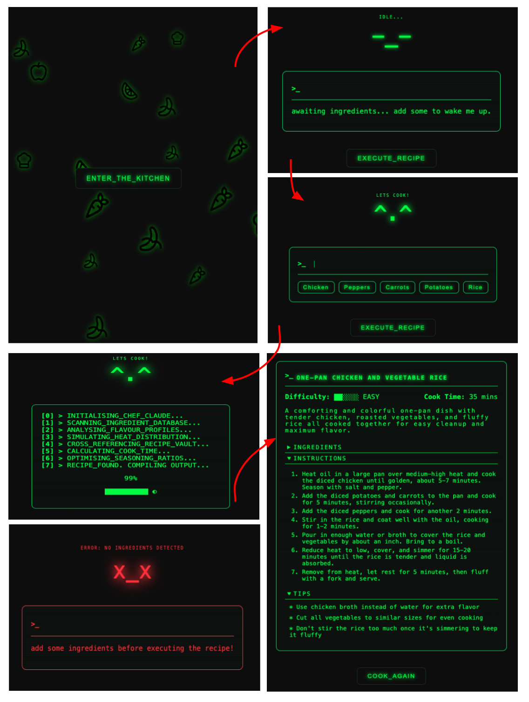

# 🍳 Matrix Chef AI

A Matrix-themed AI recipe generator built with React and Vite. Enter your ingredients and let Chef Claude generate a recipe for you. Served through a retro terminal interface.

## 📸 Preview


## ✨ Features
- Matrix-style terminal UI
- Particle rain animation landing page
- Ingredient input with dynamic tag list
- ASCII chef face animations
- Loading screen with progress animation
- AI-powered recipe generation via Anthropic Claude API
- Error handling and status messaging
- Scoped CSS Modules for component styles

## 🛠 Tech Stack
- React 19
- Vite
- Vercel (serverless functions + deployment)
- Anthropic Claude API
- tsparticles
- CSS Modules

## 🚀 Installation

```bash
git clone <your-repo-url>
cd matrix-chef
npm install
```

Create a `.env.local` file in the root of the project:
```
ANTHROPIC_API_KEY=your_api_key_here
```

Then run locally:
```bash
npm run dev
```

## 📁 Project Structure
```
matrix-chef/
├── api/
│   └── ai.js                 # Vercel serverless function
├── src/
│   ├── assets/icons/         # SVG food icons for particle animation
│   ├── components/           # React components
│   │   ├── ChefFace.jsx
│   │   ├── ClaudeRecipe.jsx
│   │   ├── LandingPage.jsx
│   │   ├── LoadingPage.jsx
│   │   ├── MainPage.jsx
│   │   └── MatrixRain.jsx
│   ├── services/
│   │   └── recipeService.js  # Anthropic API call logic
│   ├── styles/               # CSS module files
│   ├── App.jsx
│   └── main.jsx
├── .gitignore
├── index.html
├── package.json
└── vite.config.js
```